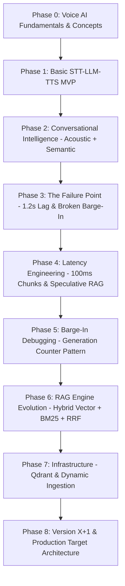
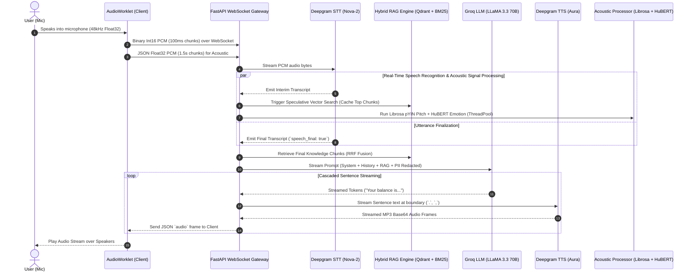

# miniVoxSetu — Real-Time Multimodal Voice AI Platform

[](file:///a:/miniVoxSetu/backend/main.py)
[](file:///a:/miniVoxSetu/frontend/src/App.jsx)
[](file:///a:/miniVoxSetu/backend/main.py#L548)
[](file:///a:/miniVoxSetu/backend/stt.py)
[](file:///a:/miniVoxSetu/backend/rag.py)

**Developer**: Harshawardhan Shrivastava  
**Project Baseline**: [miniVoxSetu GitHub Repository](https://github.com/HarrisWarner04/miniVoxSetu)  
**Demo Video**: https://drive.google.com/file/d/1G6ySJ6a4qunmbi7LL7BRzVw6A-p7Ve9t/view?usp=sharing
**Domain**: Real-Time Multimodal Voice AI for Indian Banking (NeoBank Customer Service)  
**Engineering Context**: Personal internship project built under mentor guidance to explore low-latency streaming architectures, real-time barge-in synchronization, acoustic feature extraction, and enterprise voice pipelines.

---

## 💡 About The Project

When I started working on **miniVoxSetu**, my goal wasn't just to connect an LLM to a Text-to-Speech API. I wanted to understand **how production voice systems (like those at contact centers or telecommunications providers) actually work under strict real-time constraints**.

Under the guidance of my mentors, I quickly realized that building a voice agent is fundamentally a **real-time systems engineering problem**:
- How do you reduce response lag below 300ms when ML models take time to think?
- How do you handle interruptions when audio promises resolve asynchronously after the user starts speaking?
- How do you combine raw voice acoustics (pitch, volume, emotion) with semantic text intent in real time?

**miniVoxSetu** is my working proof-of-concept for a server-driven, multimodal voice AI platform. It features streaming STT/TTS, speculative vector retrieval, hybrid BM25 search, acoustic signal classification, and a 7-layer barge-in defense system.

---

## 🚀 The Engineering Journey: How miniVoxSetu Evolved

The project went through an intense iterative evolution, moving from a simple voice loop to an optimized voice platform prototype.



### Key Milestones & Failure Modes Faced:

#### 1. The "It Works, But It Sucks" Moment (Phase 3)
When I first combined STT, RAG, LLM, TTS, and acoustic analysis in a single sequential pipeline, the system *functioned*, but user response lag exceeded **1.2 seconds**. Furthermore, when a caller interrupted the agent mid-sentence, previously synthesized audio kept playing for another 1–2 seconds.

#### 2. Solving the Audio Race Condition (The `decodeAudioData` Bug)
During barge-in debugging, I uncovered a non-trivial async race condition: the client received binary audio frames over WebSockets and queued `AudioContext.decodeAudioData()` promises. Even when VAD triggered an interruption event and switched the application state to `"user_speaking"`, pending browser promises resolved *after* the event, dumping obsolete audio into the speakers.

> [!TIP]
> **The Generation Counter Pattern**: To solve this, I introduced a monotonic `generation_id` counter. Every conversational turn increments `gen_id`. Asynchronous backend tasks and client decoders verify `task.gen_id == current_gen_id`. If an old task resolves late, it detects it is obsolete and silently discards its audio payload.

#### 3. Latency Optimization: Cut from 1.2s down to <300ms
- **Audio Worklet Chunks**: Reduced PCM buffer sizes from 250ms $\rightarrow$ **100ms** for faster backend ingress.
- **Local CPU Embeddings**: Replaced cloud embedding API calls (~150ms) with local [`sentence-transformers/all-MiniLM-L6-v2`](file:///a:/miniVoxSetu/backend/rag.py#L35) (**384 dims**, ~5ms on CPU).
- **Speculative RAG**: Fired background vector searches on *interim transcripts* and cached top chunks. If the final transcript matched the speculative query ($\ge 0.85$ cosine similarity), retrieval latency dropped to **0ms**.
- **Sentence-Boundary Cascaded TTS**: Split LLM tokens at punctuation (`.`, `?`, `!`) to start synthesizing audio immediately while the LLM was still generating tokens.

---

## 🏗️ System Architecture & Data Flow

miniVoxSetu uses a **Server-Driven Intelligence** architecture. The browser acts as a thin audio transport layer, while FastAPI orchestrates concurrent tasks using `asyncio` and thread pools.



---

## 🧠 The Three Intelligence Layers

miniVoxSetu processes conversations across three parallel intelligence tracks:

```text
                     ┌──► Layer 1: Generative Pipeline (Groq LLaMA 3.3 70B + Deepgram Aura TTS)
                     │
User Audio Input ────┼──► Layer 2: Semantic Intelligence (Gemini 2.5 Flash for Intent & Compliance)
                     │
                     └──► Layer 3: Acoustic Intelligence (Librosa Physics + HuBERT ML Emotion)
```

1. **Layer 1 — Main Generative Pipeline** ([`backend/main.py`](file:///a:/miniVoxSetu/backend/main.py)): Manages the real-time conversation loop. PII is redacted ([`backend/pii.py`](file:///a:/miniVoxSetu/backend/pii.py)), context is injected, Groq streams LLM tokens (~90ms TTFT), and Deepgram Aura streams TTS audio.
2. **Layer 2 — Semantic Intelligence** ([`backend/semantic.py`](file:///a:/miniVoxSetu/backend/semantic.py)): Executes asynchronous background analysis via Gemini 2.5 Flash to extract intent, sentiment, urgency scores, compliance risk, and suggested agent tone without blocking the main voice thread.
3. **Layer 3 — Acoustic Intelligence** ([`backend/acoustic.py`](file:///a:/miniVoxSetu/backend/acoustic.py)):
   - **Physics Layer**: Uses `Librosa` for fundamental pitch tracking ($F_0$ via pYIN), RMS volume ($\text{dB}$), Zero-Crossing Rate (ZCR), and spectral centroid.
   - **ML Layer**: Uses PyTorch `superb/hubert-base-superb-er` fine-tuned on IEMOCAP to classify 4 voice emotions (`neutral`, `happy`, `angry`, `sad`).

---

## 🛡️ 7-Layer Barge-In System

To handle interruptions in under 300ms without false triggers from backchannel sounds ("uh-huh"), miniVoxSetu employs a multi-tiered barge-in protocol:


- **Layer 1 (Client VAD)**: AudioWorklet energy check running every 2.7ms frame.
- **Layer 2 (AEC)**: Web Audio API Acoustic Echo Cancellation prevents the agent's own speaker output from re-triggering microphone VAD.
- **Layer 3 (Client Queue Flush)**: Instantly stops active `AudioBufferSourceNode` playback and clears queued audio frames.
- **Layer 4 (WS Signal)**: Emits `type: "barge_in"` frame to backend.
- **Layer 5 (Gen ID Increment)**: Increments `generation_id` on the session state.
- **Layer 6 (Server Gating)**: Sets `interrupted = True` in pipeline execution context.
- **Layer 7 (Task Pruning)**: In-flight LLM/TTS async tasks check `generation_id` before sending audio and discard obsolete outputs.

---

## 🔍 RAG Engine: Hybrid Vector + Lexical Search with RRF

Standard vector search often fails on exact financial terminology (e.g. *IFSC*, *NEFT*, *TDS 15G*, *RuPay*). I upgraded [`backend/rag.py`](file:///a:/miniVoxSetu/backend/rag.py) to a **Hybrid Search Engine**:

$$\text{Query} \longrightarrow \begin{cases} \text{Vector Search (384-dim MiniLM)} & \longrightarrow \text{Semantic Ranking} \\ \text{BM25 Search (Okapi Keyword)} & \longrightarrow \text{Lexical Ranking} \end{cases} \longrightarrow \text{RRF Fusion} \longrightarrow \text{Top-N Results}$$

$$\text{RRF Score}(d) = \sum_{r \in R} \frac{1}{k + \text{rank}(d, r)}, \quad k=60$$

- **Qdrant Vector Database**: Supports both local Docker container and Qdrant Cloud modes (`QdrantVectorStore`), with an in-memory `SimpleVectorStore` fallback.
- **Dynamic Ingestion**: [`backend/ingest.py`](file:///a:/miniVoxSetu/backend/ingest.py) parses PDF/TXT/Markdown files into 500-character chunks with SHA-256 deduplication.

---

## ⚖️ MVP vs. Production Architectural Summary

*For the complete 20-dimension deep dive analysis, see [`MVP_VS_PRODUCTION.md`](file:///a:/miniVoxSetu/MVP_VS_PRODUCTION.md).*

| Component | Current MVP Implementation (This Repo) | Target Production Architecture |
| :--- | :--- | :--- |
| **Speech & LLM Models** | Cloud APIs (Groq LLaMA 3.3 70B, Deepgram Nova-2/Aura) | Self-hosted vLLM cluster (LLaMA 3.3 70B / Qwen 2.5 72B), Whisper-Live |
| **PII Redaction** | Regex pattern matching ([`backend/pii.py`](file:///a:/miniVoxSetu/backend/pii.py)) | Contextual ML (Microsoft Presidio + SpaCy NER + Indian entity tokenizers) |
| **Acoustic Model** | PyTorch `superb/hubert-base-superb-er` + Librosa pYIN | **WavLM** (pre-trained on noisy speech, superior for street/cellular static) |
| **Real-Time Transport** | WebSockets over TCP (`ws://localhost:8000/ws/chat`) | WebRTC over UDP (ICE/STUN/TURN) for app calls; SIP Trunking for PSTN 1-800 lines |
| **Concurrency & State** | Single FastAPI process + `ThreadPoolExecutor` + in-memory dict | Decoupled Transceiver-Relay Gateway + Redis Cluster session store |

---

## 📂 Codebase Inventory

```text
miniVoxSetu/
├── backend/
│   ├── main.py            # FastAPI app, WebSocket endpoint, pipeline orchestrator
│   ├── acoustic.py        # Librosa signal processing + PyTorch HuBERT emotion model
│   ├── rag.py             # Hybrid Vector (Qdrant/MiniLM) + BM25 search engine with RRF
│   ├── pii.py             # Pre-LLM Regex PII redaction layer (Indian banking entity patterns)
│   ├── stt.py             # Deepgram Nova-2 streaming WebSocket client
│   ├── tts.py             # Deepgram Aura streaming WebSocket client
│   ├── semantic.py        # Async background Gemini 2.5 Flash NLU analysis
│   ├── ingest.py          # Document chunking, SHA-256 deduplication, and Qdrant ingestion
│   ├── eval_harness.py    # Automated benchmarking suite (Precision@N, latency, PII recall)
│   └── requirements.txt   # Python dependencies
├── frontend/
│   ├── public/
│   │   └── pcm-processor.js # AudioWorklet PCM extractor & 2.7ms frame VAD
│   └── src/
│       ├── App.jsx        # Main React dashboard, WebSocket client, audio playback
│       └── index.css      # Dark mode styling & live telemetry UI indicators
├── MVP_VS_PRODUCTION.md   # Master 20-dimension enterprise upgrade blueprint
└── JOURNEY.md             # Detailed engineering post-mortem and phase-by-phase story
```

---

## 🛠️ Setup & Local Installation

### Prerequisites
- Python 3.10+ installed
- Node.js 18+ installed
- Optional: Docker installed (if running Qdrant vector database locally)

### 1. Backend Setup

```bash
# Clone the repository
git clone https://github.com/HarrisWarner04/miniVoxSetu.git
cd miniVoxSetu/backend

# Create virtual environment & activate
python -m venv .venv
# On Windows:
.venv\Scripts\activate
# On Linux/macOS:
source .venv/bin/activate

# Install dependencies
pip install -r requirements.txt
```

### 2. Environment Variables Configuration

Copy `.env.example` to `.env` in the `backend/` directory:

```bash
cp .env.example .env
```

Fill in your API keys in `backend/.env`:
```env
GROQ_API_KEY=your_groq_api_key
DEEPGRAM_API_KEY=your_deepgram_api_key
GEMINI_API_KEY=your_gemini_api_key

# Optional Qdrant Vector DB mode (default: memory)
VECTOR_DB_MODE=memory
# QDRANT_URL=http://localhost:6333
```

### 3. Start the Backend Server

```bash
uvicorn main:app --reload --port 8000
```
*Backend server will start on `http://localhost:8000`.*

### 4. Frontend Setup & Run

Open a new terminal window:

```bash
cd miniVoxSetu/frontend

# Install dependencies
npm install

# Start Vite dev server
npm run dev
```
*Frontend dashboard will be available at `http://localhost:5173`.*

---

## 🧪 Running the Evaluation Suite

To run the automated benchmark harness evaluating hybrid retrieval precision, PII recall, and embedding latency:

```bash
cd backend
python eval_harness.py
```

---

## 👤 Author & Acknowledgments

**Developed by**: [Harshawardhan Shrivastava](https://github.com/HarrisWarner04)  
*Built as a dedicated learning and portfolio project to explore real-time voice systems, streaming LLMs, acoustic signal processing, and low-latency architectures.*

Special thanks to my mentors and the open-source community behind FastAPI, PyTorch, Deepgram, Groq, Qdrant, and SentenceTransformers.
