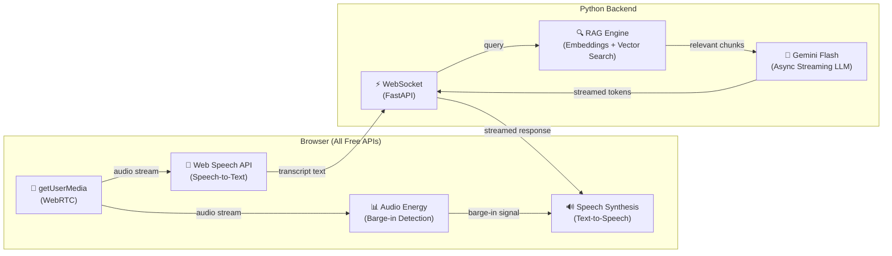
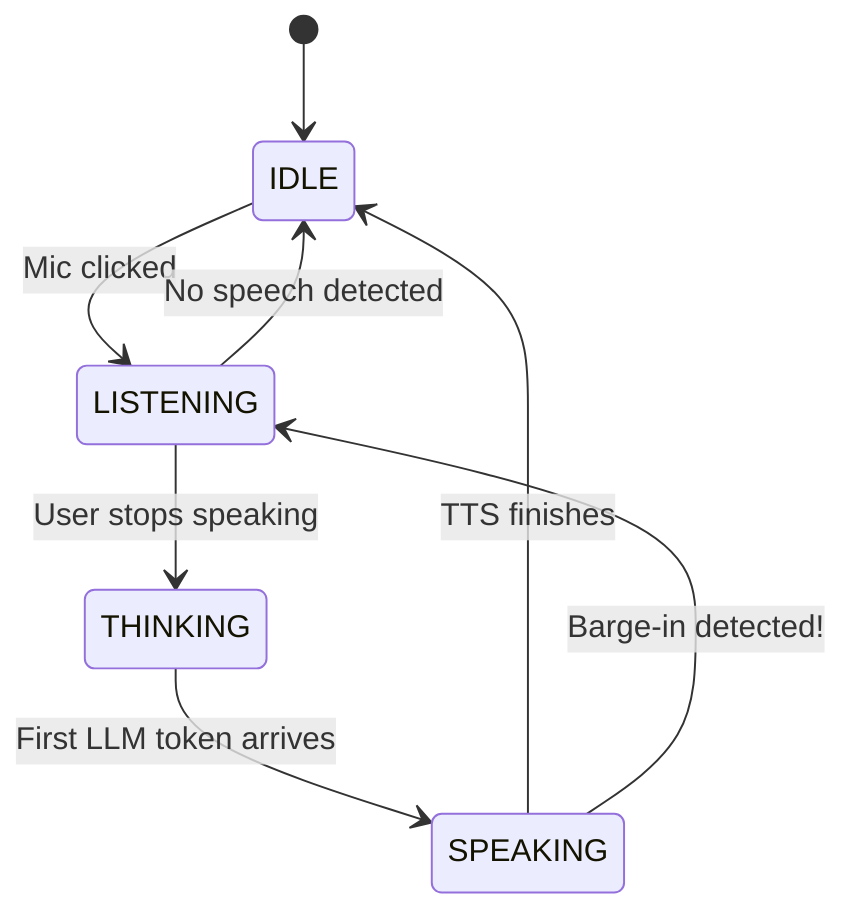

# miniVoxSetu — Complete Project Walkthrough

> **What is this?** A minimal voice AI agent built to teach you how production systems like VoxSetu work. Every line of code has a purpose, and every meaningful block has a WHY comment explaining the architectural reason it exists.

---

## Table of Contents

1. [The Big Picture](#the-big-picture)
2. [Architecture Diagram](#architecture-diagram)
3. [The Voice AI Pipeline](#the-voice-ai-pipeline)
4. [File-by-File Breakdown](#file-by-file-breakdown)
5. [The 7 Core Concepts](#the-7-core-concepts)
6. [Edge Cases Handled](#edge-cases-handled)
7. [State Machine](#state-machine)
8. [Data Flow (A Complete Turn)](#data-flow-a-complete-turn)
9. [Tech Stack Decisions](#tech-stack-decisions)
10. [How to Run](#how-to-run)
11. [What Production Systems Do Differently](#what-production-systems-do-differently)

---

## The Big Picture

Voice AI agents have a deceptively simple core loop:

```
User speaks → Convert speech to text → Send text to AI → Convert AI response to speech → User hears it
```

But the engineering complexity hides in the **transitions between stages**, the **latency requirements** (humans notice delays > 200ms), and the **interruption handling** (barge-in). This project implements all of it.

---

## Architecture Diagram



### What lives where and why

| Component | Location | Why There |
|-----------|----------|-----------|
| **STT** | Browser | Web Speech API is free, runs locally, zero network latency |
| **TTS** | Browser | Speech Synthesis is free, instant cancel enables barge-in |
| **VAD** | Browser | Audio analysis must be real-time, can't afford network round-trip |
| **LLM** | Backend | Gemini API key must stay server-side (security) |
| **RAG** | Backend | Embeddings + vector search happen near the LLM for efficiency |
| **WebSocket** | Both | Enables streaming — tokens flow as they're generated |

---

## The Voice AI Pipeline

The system follows a strict **linear pipeline** for each conversation turn:

```
┌──────────┐    ┌──────────┐    ┌──────────┐    ┌──────────┐    ┌──────────┐
│  1. MIC  │───▶│  2. STT  │───▶│  3. LLM  │───▶│  4. TTS  │───▶│ 5. SPEAK │
│ Capture  │    │ Transcribe│   │ + RAG    │    │ Synthesize│   │ to User  │
└──────────┘    └──────────┘    └──────────┘    └──────────┘    └──────────┘
                                                      ▲
                                                      │ CANCEL
                                                ┌──────────┐
                                                │ BARGE-IN │
                                                │ (VAD)    │
                                                └──────────┘
```

> [!IMPORTANT]
> The **barge-in** path is what separates a toy voice app from a real voice AI agent. Without it, the user has to wait for the AI to finish speaking before they can talk again — that feels unnatural and frustrating.

---

## File-by-File Breakdown

### Backend: [main.py](file:///a:/miniVoxSetu/backend/main.py)

**Purpose:** The brain of the operation — receives user text via WebSocket, runs RAG retrieval, calls Gemini with async streaming, and sends response chunks back.

#### Key sections:

| Lines | What | Why |
|-------|------|-----|
| [24-36](file:///a:/miniVoxSetu/backend/main.py#L24-L36) | Environment setup | `.env` keeps API keys out of source code |
| [44-56](file:///a:/miniVoxSetu/backend/main.py#L44-L56) | Lifespan handler | RAG embeddings computed once at startup, not per-request |
| [65-74](file:///a:/miniVoxSetu/backend/main.py#L65-L74) | CORS middleware | Frontend and backend run on different origins |
| [77-84](file:///a:/miniVoxSetu/backend/main.py#L77-L84) | System prompt | Shapes AI personality — tuned for voice (concise, conversational) |
| [93-103](file:///a:/miniVoxSetu/backend/main.py#L93-L103) | WebSocket endpoint | Streaming over WebSocket instead of REST for real-time token delivery |
| [122-136](file:///a:/miniVoxSetu/backend/main.py#L122-L136) | RAG retrieval | Search FAQ before every LLM call — inject domain knowledge |
| [147-159](file:///a:/miniVoxSetu/backend/main.py#L147-L159) | History building | Full conversation array sent to stateless LLM — this IS its memory |
| [173-198](file:///a:/miniVoxSetu/backend/main.py#L173-L198) | Async Streaming | Uses `send_message_async` so the server event loop isn't blocked |

---

### Backend: [rag.py](file:///a:/miniVoxSetu/backend/rag.py)

**Purpose:** Implements RAG (Retrieval-Augmented Generation) — the technique that lets the LLM answer questions about NeoBank despite never being trained on NeoBank data.

#### Key sections:

| Lines | What | Why |
|-------|------|-----|
| [31-104](file:///a:/miniVoxSetu/backend/rag.py#L31-L104) | SimpleVectorStore | NumPy-based vector DB — mirrors ChromaDB's interface exactly |
| [64-101](file:///a:/miniVoxSetu/backend/rag.py#L64-L101) | Cosine similarity search | `cos(A,B) = dot(A,B) / (‖A‖·‖B‖)` — the math behind semantic search |
| [115-139](file:///a:/miniVoxSetu/backend/rag.py#L115-L139) | FAQ documents | 8 hardcoded knowledge chunks about fictional NeoBank |
| [165-178](file:///a:/miniVoxSetu/backend/rag.py#L165-L178) | `_embed_text()` | Converts documents to 768-dim vectors using `text-embedding-004` |
| [180-193](file:///a:/miniVoxSetu/backend/rag.py#L180-L193) | `_embed_query()` | Query embeddings use `retrieval_query` task type for better matching |
| [195-222](file:///a:/miniVoxSetu/backend/rag.py#L195-L222) | `initialize()` | Embeds all FAQ docs at startup — indexing phase |
| [224-241](file:///a:/miniVoxSetu/backend/rag.py#L224-L241) | `retrieve()` | Runs on every user query — finds top-2 most relevant chunks |

---

### Frontend: [App.jsx](file:///a:/miniVoxSetu/frontend/src/App.jsx)

**Purpose:** The entire voice AI pipeline in one file. 

#### Custom Hooks:

| Hook | Lines | Purpose |
|------|-------|---------|
| `useWebSocket` | [48-110](file:///a:/miniVoxSetu/frontend/src/App.jsx#L48-L110) | Manages WebSocket lifecycle — connect, reconnect, send, receive |
| `useSpeechRecognition` | [126-211](file:///a:/miniVoxSetu/frontend/src/App.jsx#L126-L211) | Wraps Web Speech API — start/stop, interim/final results |
| `useSpeechSynthesis` | [228-286](file:///a:/miniVoxSetu/frontend/src/App.jsx#L228-L286) | Wraps Speech Synthesis — caches voices, speaks, cancels for barge-in |

#### Core pipeline functions:

| Function | Lines | Role in Pipeline |
|----------|-------|-----------------|
| `startVAD()` | [388-412](file:///a:/miniVoxSetu/frontend/src/App.jsx#L388-L412) | Captures mic stream via `getUserMedia` for energy analysis |
| `startBargeInDetection()` | [436-468](file:///a:/miniVoxSetu/frontend/src/App.jsx#L436-L468) | Polls audio energy every 100ms — triggers barge-in if > threshold |
| `handleBargeIn()` | [483-492](file:///a:/miniVoxSetu/frontend/src/App.jsx#L483-L492) | Cancels TTS instantly, switches to LISTENING |
| `startListening()` | [499-527](file:///a:/miniVoxSetu/frontend/src/App.jsx#L499-L527) | Starts STT, accumulates transcript |
| `stopListeningAndProcess()` | [534-542](file:///a:/miniVoxSetu/frontend/src/App.jsx#L534-L542) | Stops STT, hands text to `processUserInput` |
| `processUserInput()` | [553-576](file:///a:/miniVoxSetu/frontend/src/App.jsx#L553-L576) | Adds to history, sends full history to backend via WebSocket |
| WebSocket handler | [590-654](file:///a:/miniVoxSetu/frontend/src/App.jsx#L590-L654) | Handles `rag_context`, `chunk`, `done`, `error` messages |
| `handleMicClick()` | [667-694](file:///a:/miniVoxSetu/frontend/src/App.jsx#L667-L694) | State-dependent mic button behavior |

---

## The 7 Core Concepts

### 1. WebRTC Mic Capture
```javascript
const stream = await navigator.mediaDevices.getUserMedia({ audio: true });
```
`getUserMedia` is the browser API that ALL voice applications use to access the microphone. It returns a `MediaStream` that can be analyzed (for VAD) or sent to a server (for cloud STT in production).

### 2. Speech-to-Text (STT)
Using `continuous = true` and `interimResults = true`.
Without interim results, the user sees nothing until they stop talking. With them, words appear as they speak — making the voice AI feel responsive.

### 3. LLM with Async Streaming
```python
response = await chat.send_message_async(user_text, stream=True)
async for chunk in response:
    await websocket.send_text(...)
```
Streaming is critical because:
1. TTS can start speaking the first sentence while the rest generates
2. Perceived latency drops from 2-3 seconds to ~300ms
Using `send_message_async` prevents the server's event loop from blocking.

### 4. Text-to-Speech (TTS)
```javascript
window.speechSynthesis.speak(utterance);
```
TTS voices are preloaded via the `voiceschanged` event so we don't accidentally use the robotic default voice on the first turn.

### 5. Barge-in (Interruption Handling)
```javascript
const handleBargeIn = useCallback(() => {
    cancelTTS();              // Stop AI speech INSTANTLY
    setAgentState(STATES.LISTENING);  // Switch to listening
    startListening();         // Begin capturing new input
}, [cancelTTS]);
```
We poll microphone audio levels every 100ms during the `SPEAKING` state. If energy exceeds 30, it triggers a barge-in and stops TTS instantly using `speechSynthesis.cancel()`.

### 6. Context Window (Conversation History)
LLM APIs are **stateless**. The frontend stores the complete conversation array and sends it to the backend on every turn. The backend passes this full array into Gemini's `start_chat()`. This array IS the model's memory.

### 7. RAG (Retrieval-Augmented Generation)
1. **Indexing:** Embed 8 FAQ documents at startup.
2. **Retrieval:** On user query, embed it and find top-2 most similar docs via cosine similarity.
3. **Injection:** Append to the system prompt before calling Gemini.

---

## Edge Cases Handled

Production voice AI isn't just about the happy path. `miniVoxSetu` handles these critical edge cases:

1. **WebSocket URL via Vite Proxy:** Hardcoding `localhost:8000` breaks in production behind a reverse proxy. We dynamically use `window.location.host`.
2. **Blocking Sync Streaming:** A synchronous `send_message` with `for chunk` would block FastAPI's event loop. We use `send_message_async` and `async for` so the server can handle multiple clients.
3. **TTS Voices Not Loaded:** Browsers load TTS voices asynchronously. We use the `voiceschanged` event to cache them to avoid the default robotic voice.
4. **Duplicate AudioContexts:** Rapidly clicking the mic button could exhaust the browser's AudioContext limits. We guard against duplicate creation.
5. **Barge-in Interval Accumulation:** We clear any existing VAD interval before starting a new one to prevent multiple intervals checking audio simultaneously.
6. **Stuck UI on Disconnect:** If the WebSocket disconnects mid-conversation, a safety `useEffect` resets the state to `IDLE`.

---

## State Machine

The agent is a **finite state machine** with 4 states:



---

## Data Flow (A Complete Turn)

Here's exactly what happens when you say "What interest rate do you offer?":

```
 Time   │ Component   │ What Happens
────────┼─────────────┼──────────────────────────────────────────
 0ms    │ Browser     │ User clicks mic → getUserMedia captures audio
 50ms   │ STT         │ Speech Recognition starts → interim: "what"
 200ms  │ STT         │ interim: "what interest"
 400ms  │ STT         │ interim: "what interest rate do"
 800ms  │ STT         │ final: "What interest rate do you offer?"
 850ms  │ React       │ User clicks mic again → stopListeningAndProcess()
 860ms  │ React       │ Add user turn to conversationHistory[]
 870ms  │ WebSocket   │ Send {text, history} to backend
 900ms  │ RAG         │ Embed query → cosine search → find FAQ about rates
 950ms  │ WebSocket   │ Send rag_context back to frontend
 960ms  │ Gemini      │ Start async streaming with history + RAG context
 1100ms │ WebSocket   │ chunk: "NeoBank offers"
 1150ms │ WebSocket   │ chunk: " 4.5% APY"
 1400ms │ WebSocket   │ done: full response complete
 1410ms │ React       │ Add assistant turn to conversationHistory[]
 1420ms │ TTS         │ Start speaking the complete response
```

---

## Tech Stack Decisions

| Component | Choice | Why This | Production Alternative |
|-----------|--------|----------|----------------------|
| **STT** | Web Speech API | Free, zero-setup, real-time | Deepgram, Google Cloud STT |
| **LLM** | Gemini 2.0 Flash | Free tier, fast, streaming | GPT-4, Claude, Llama |
| **TTS** | Web Speech Synthesis | Free, instant cancel | ElevenLabs, Google Cloud TTS |
| **Embeddings** | text-embedding-004 | Free tier, 768-dim | OpenAI ada-002, Cohere embed |
| **Vector DB** | NumPy cosine | Zero dependencies, transparent math | ChromaDB, Pinecone |
| **Transport** | WebSocket | Bidirectional streaming | gRPC |
| **Backend** | FastAPI | Async-native | Node.js, Go |

---

## What Production Systems Do Differently

| This Project | Production (VoxSetu-class) |
|-------------|--------------------------|
| Web Speech API (browser STT) | Cloud STT (Deepgram/Google) — higher accuracy |
| Speech Synthesis (browser TTS) | Cloud TTS (ElevenLabs) — natural voices, SSML |
| Audio energy threshold for VAD | ML-based VAD (Silero) — better noise rejection |
| Full history every call | Token counting + truncation at context limit |
| In-memory vector store | Persistent vector DB (Pinecone/pgvector) with millions of docs |
| Single WebSocket | gRPC streams with connection pooling |
| Hardcoded FAQ | Document ingestion pipeline, chunking strategies, metadata filters |

> [!IMPORTANT]
> Despite these differences, the **architectural patterns are identical**. The pipeline flow (STT → RAG → LLM → TTS), the state machine, the async streaming approach, the conversation history management, and the barge-in mechanism are the same in this learning project and in production systems.
